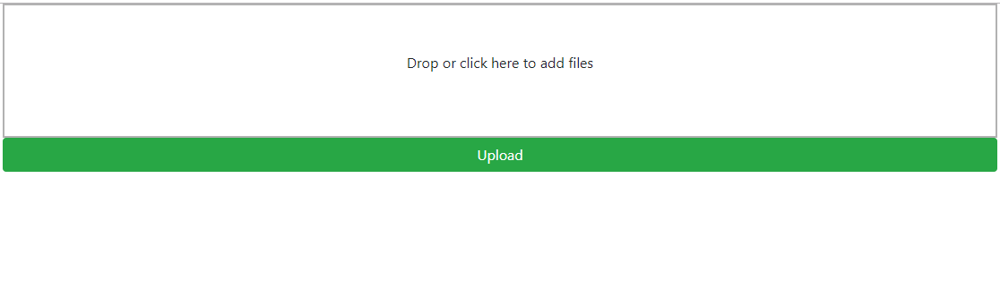

This is a Flask app that demonstrates how to upload file(s) directly to S3 using pre-signed post.
The frontend is powered by Dropzone.js that enables features like drag-and-drop, queued upload, etc.

## Prerequisite

* Make sure the server running Flask app has sufficient IAM permissions to generate S3 pre-signed post.
* Make sure the destination bucket allows Cross-Origin Resource Sharing (CORS).
```xml
<?xml version="1.0" encoding="UTF-8"?>
<CORSConfiguration xmlns="http://s3.amazonaws.com/doc/2006-03-01/">
<CORSRule>
    <AllowedOrigin>*</AllowedOrigin>
    <AllowedMethod>PUT</AllowedMethod>
    <AllowedMethod>POST</AllowedMethod>
    <AllowedMethod>GET</AllowedMethod>
    <AllowedMethod>HEAD</AllowedMethod>
    <MaxAgeSeconds>3000</MaxAgeSeconds>
    <AllowedHeader>*</AllowedHeader>
</CORSRule>
</CORSConfiguration>
```

## Example

### Success


### Error


## Reference

* [https://www.dropzonejs.com/](https://www.dropzonejs.com/)
* [https://boto3.amazonaws.com/v1/documentation/api/latest/guide/s3.html](https://boto3.amazonaws.com/v1/documentation/api/latest/guide/s3.html#generating-presigned-posts)
